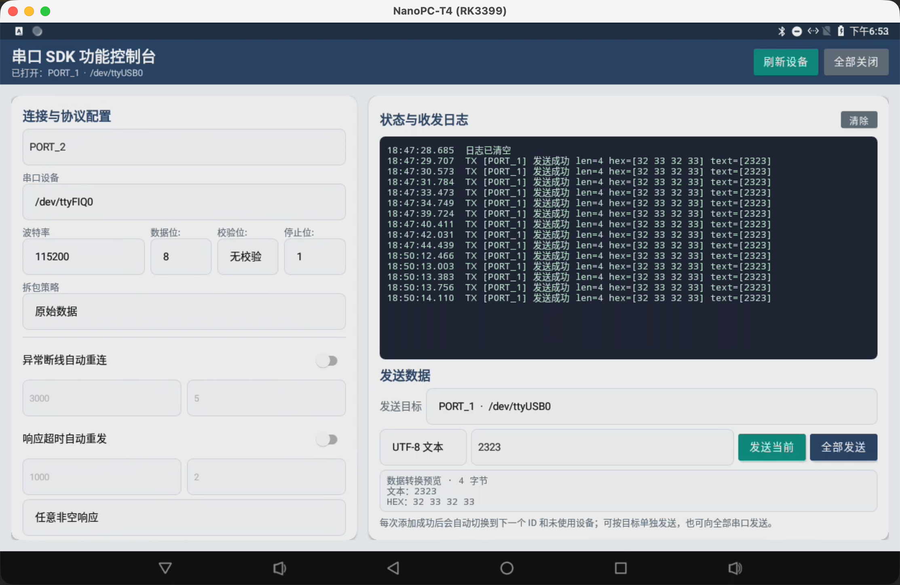
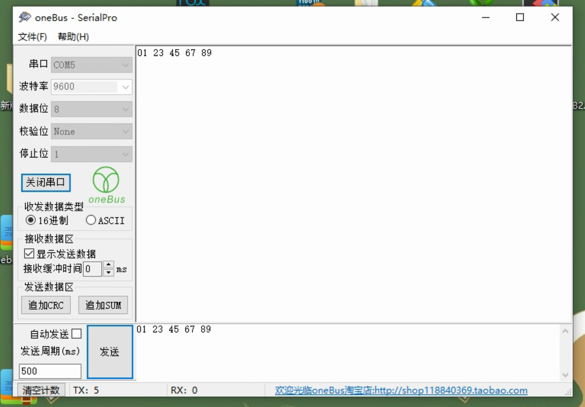

# Android 串口通信框架 SerialPort

[中文](README.md) | [English](README_EN.md)

[](https://github.com/cl-6666/serialPort)
[](https://developer.android.com/tools/releases/platforms)
[](https://www.apache.org/licenses/LICENSE-2.0)

一个面向 Android 设备的轻量串口 SDK。支持单串口、多串口、协议拆包、异常断线重连、响应超时重发、统一错误回调和可替换日志输出。

<p align="center">
  
</p>

## 功能特性

- Kotlin 实现，Java 项目也可调用。
- 支持单串口和多串口，每路连接使用独立配置和收发队列。
- 支持 5～8 数据位、奇偶校验、SPACE/MARK 校验和 1/2 停止位。
- 支持原始数据、分隔符、固定长度、变长协议、空闲超时和自定义拆包器。
- 支持异常断线自动重连，可配置间隔和最大次数。
- 支持响应超时自动重发，可自定义响应匹配规则。
- 收发运行在 IO 协程，发送队列按顺序写入。
- 支持统一错误对象、自定义日志输出和关闭详细日志。
- 支持 `arm64-v8a`、`armeabi-v7a`、`x86`、`x86_64`。
- Android 5.0（API 21）及以上；64 位原生库已配置 16 KB 页面大小链接选项。

## 安装

在根项目仓库中加入 JitPack：

```groovy
dependencyResolutionManagement {
    repositories {
        google()
        mavenCentral()
        maven { url 'https://jitpack.io' }
    }
}
```

在应用模块中加入依赖：

```groovy
dependencies {
    implementation 'com.github.cl-6666:serialPort:v5.0.8'
}
```

如果直接复制 AAR，调用方还需要提供 Kotlin 标准库和协程 Core：

```groovy
implementation files('libs/serial_lib-release.aar')
implementation 'org.jetbrains.kotlin:kotlin-stdlib:2.0.21'
implementation 'org.jetbrains.kotlinx:kotlinx-coroutines-core:1.8.1'
```

SDK 不需要 `Application`、`Context` 或 Android Manifest 权限。应用进程必须对目标 `/dev/tty*` 节点具有读写权限；普通应用通常需要系统签名、设备厂商授权、SELinux 配置或 root 环境支持。

## 快速开始：单串口

推荐使用 `create()` 创建与页面或业务组件生命周期一致的管理器。配置完成后必须先调用 `init(config)`：

```kotlin
private val serialManager = SimpleSerialPortManager.create()

private fun openSerialPort() {
    val config = SerialConfig.Builder()
        .setDatabits(8)
        .setParity(0)
        .setStopbits(1)
        .setEnableLogging(BuildConfig.DEBUG)
        .build()

    serialManager
        .init(config)
        .setOnSerialErrorListener { error ->
            Log.e("Serial", "${error.code}: ${error.message}", error.cause)
        }

    val opened = serialManager.openSerialPort(
        devicePath = "/dev/ttyS4",
        baudRate = 115200,
        openCallback = { success, status ->
            Log.i("Serial", "opened=$success, status=$status")
        },
        dataCallback = object : SimpleSerialPortManager.OnDataReceivedCallback {
            override fun onDataReceived(data: ByteArray) {
                Log.d("Serial", "RX=${data.toHexString()}")
            }

            override fun onDataSent(data: ByteArray) {
                Log.d("Serial", "TX=${data.toHexString()}")
            }
        },
    )

    if (!opened) Log.e("Serial", "串口打开请求失败")
}

private fun sendCommand() {
    val accepted = serialManager.sendData(byteArrayOf(0x01, 0x03, 0x00, 0x00))
    if (!accepted) Log.e("Serial", "连接不可用或发送队列已满")
}

override fun onDestroy() {
    serialManager.close()
    super.onDestroy()
}

private fun ByteArray.toHexString(): String =
    joinToString(" ") { byte -> "%02X".format(byte.toInt() and 0xFF) }
```

`openSerialPort()` 是同步接口。设备权限检查可能较慢，正式项目建议在工作线程或 `Dispatchers.IO` 中调用；门面管理器的状态、收发、可靠发送和错误回调会切换到主线程。

## 多串口

使用 `createMulti()` 创建独立的多串口管理器。每一路串口使用唯一 ID，并在打开时传入自己的 `SerialConfig`：

```kotlin
private val serialPorts = SimpleSerialPortManager.createMulti()

private fun openPort(serialId: String, path: String, baudRate: Int) {
    val config = SerialConfig.Builder()
        .setDatabits(8)
        .setParity(0)
        .setStopbits(1)
        .setStickyPacketHelpers(SpecifiedStickPackageHelper("\r\n"))
        .build()

    val opened = serialPorts.openSerialPort(
        serialId,
        path,
        baudRate,
        config,
        { id, success, status ->
            Log.i("Serial", "[$id] opened=$success, status=$status")
        },
        object : MultiSerialPortManager.OnSerialPortDataCallback {
            override fun onDataReceived(serialId: String, data: ByteArray) {
                Log.d("Serial", "RX [$serialId] ${data.size} bytes")
            }

            override fun onDataSent(serialId: String, data: ByteArray) {
                Log.d("Serial", "TX [$serialId] ${data.size} bytes")
            }
        },
    )

    if (!opened) Log.e("Serial", "[$serialId] 打开失败")
}

private fun usePorts() {
    openPort("GPS", "/dev/ttyS1", 9600)
    openPort("SENSOR", "/dev/ttyS2", 115200)

    serialPorts.sendData("GPS", "AT+GPS?\r\n")
    serialPorts.sendData("SENSOR", byteArrayOf(0x01, 0x03))

    val openedIds = serialPorts.openedSerialPorts
    val gpsOpened = serialPorts.isSerialPortOpened("GPS")

    serialPorts.closeSerialPort("GPS")
    serialPorts.closeAllSerialPorts()
}
```

同一个 ID 再次打开时，SDK 会先关闭该 ID 的旧连接。业务层应保证 ID 和设备路径唯一，避免意外替换或重复打开同一设备。

## 串口配置

推荐通过统一的 `SerialConfig` 配置单串口和多串口：

```kotlin
val config = SerialConfig.Builder()
    .setDatabits(8)                 // 5、6、7、8
    .setParity(0)                   // 0无、1奇、2偶、3 SPACE、4 MARK
    .setStopbits(1)                 // 1、2
    .setFlags(0)
    .setIntervalSleep(50)           // 原始数据模式无数据时的轮询间隔
    .setMaxPacketSize(1_024)        // 单个数据包最大字节数
    .setPacketTimeout(1_000)        // 半包超过 1 秒未完成则丢弃并继续接收
    .setAutoReconnect(true)
    .setReconnectInterval(3_000)
    .setMaxReconnectAttempts(5)
    .build()
```

`SerialConfig` 会在构建时校验数据位、停止位、校验位和超时参数，非法值会抛出 `IllegalArgumentException`。

`packetTimeout` 从收到首字节后开始按“字节间空闲时间”计时，不会因为串口暂时没有数据而触发。超时或超长数据包会通过 `OnSerialErrorListener` 分别报告 `PACKET_TIMEOUT`、`PACKET_TOO_LARGE`，接收任务随后继续运行。

## 拆包策略

| 处理器 | 适用场景 | 示例 |
|---|---|---|
| `BaseStickPackageHelper` | 原始字节流 | `BaseStickPackageHelper(50)` |
| `SpecifiedStickPackageHelper` | 换行、AT、头尾标识协议 | `SpecifiedStickPackageHelper("\r\n")` |
| `StaticLenStickPackageHelper` | 固定长度协议 | `StaticLenStickPackageHelper(8)` |
| `VariableLenStickPackageHelper` | 包内包含长度字段 | `VariableLenStickPackageHelper(ByteOrder.BIG_ENDIAN, 2, 2, 12)` |
| `TimeoutStickPackageHelper` | 空闲一段时间视为一包 | `TimeoutStickPackageHelper(50)` |
| `CompositeStickPackageHelper` | 主策略和备用策略组合 | `CompositeStickPackageHelper(primary, fallback)` |

```kotlin
val config = SerialConfig.Builder()
    .setEnableStickyPacketProcessing(true)
    .setStickyPacketHelpers(SpecifiedStickPackageHelper("\n"))
    .build()
```

自定义协议可以实现 `AbsStickPackageHelper`：

```kotlin
val customHelper = AbsStickPackageHelper { inputStream ->
    // 阻塞读取并在得到一帧完整数据后返回 ByteArray
    null
}
```

## 自动重连

```kotlin
val config = SerialConfig.Builder()
    .setAutoReconnect(true)
    .setReconnectInterval(3_000)
    .setMaxReconnectAttempts(5)
    .build()
```

- 只有读写异常或设备节点消失才会触发自动重连。
- 主动调用 `closeSerialPort()` 或 `close()` 不会触发重连。
- 重连成功会再次回调 `SUCCESS_OPENED`。
- 达到最大次数后会回调 `OPEN_FAIL`，并报告 `RECONNECT_EXHAUSTED`。

## 响应超时重发

```kotlin
val config = SerialConfig.Builder()
    .setEnableReliableSend(true)
    .setResponseTimeoutMillis(1_000)
    .setMaxSendRetries(2)
    .setSendRetryIntervalMillis(200)
    .setResponseMatcher { request, response ->
        request.isNotEmpty() && response.isNotEmpty() && request[0] == response[0]
    }
    .build()
```

```kotlin
serialManager.setOnReliableSendListener(object : OnReliableSendListener {
    override fun onRetry(data: ByteArray, retryCount: Int, maxRetries: Int) {
        Log.w("Serial", "retry=$retryCount/$maxRetries")
    }

    override fun onSuccess(data: ByteArray, response: ByteArray) {
        Log.i("Serial", "收到匹配响应")
    }

    override fun onFailure(data: ByteArray, reason: ReliableSendFailure) {
        Log.e("Serial", "可靠发送失败: $reason")
    }
})
```

多串口需要在对应连接打开成功后调用 `setOnReliableSendListener(serialId, listener)`。

没有设置 `responseMatcher` 时，任意非空数据包都会被视为当前请求的响应。协议存在主动上报或并发消息时，必须按地址、命令字或流水号进行匹配。

`sendData()` 返回 `true` 只表示数据已进入发送队列；`onDataSent` 表示一次物理写入完成；可靠发送的 `onSuccess` 表示已经收到匹配响应。

## 错误与日志

统一错误对象 `SerialError` 包含 `code`、`message`、`cause`、`devicePath` 和多串口 `serialId`：

```kotlin
serialPorts.setOnSerialErrorListener { error ->
    Log.e(
        "Serial",
        "id=${error.serialId}, device=${error.devicePath}, code=${error.code}, ${error.message}",
        error.cause,
    )
}
```

生产环境建议关闭详细日志，或替换为自己的日志实现：

```kotlin
SerialPortLogUtil.setDebugEnabled(false)

SerialPortLogUtil.setLogger { level, tag, message, throwable ->
    // 输出到应用已有的日志系统；请避免记录敏感业务数据
}
```

## 生命周期与线程

- 页面级或组件级连接：使用 `create()` / `createMulti()`，在 `onDestroy()`、`onCleared()` 或组件释放时调用 `close()`。
- 跨页面长期连接：由 Repository、Service 或前台 Service 持有管理器，并由持有者统一释放。
- 不要求在 `Application` 中初始化；旧的 `init(application)` 和 `QuickConfig.apply(application)` 仅为兼容保留，已经废弃。
- `getInstance()` / `multi()` 返回全局单例，适合明确需要全局连接的场景；必须避免多个页面互相关闭同一个实例。
- `sendData()` 是非阻塞入队；单路发送队列容量为 64。
- `SimpleSerialPortManager` 和 `MultiSerialPortManager` 的业务回调派发到主线程。

## 设备扫描与权限排查

```kotlin
val paths: Array<String> = SerialPortFinder().allDevicesPath
paths.forEach { path -> Log.d("Serial", path) }
```

打开失败时依次检查：

1. `/dev/tty*` 节点是否真实存在。
2. 应用进程是否具有读写权限。
3. SELinux 是否阻止访问。
4. 波特率是否在 SDK 支持列表中。
5. 是否有其他进程或连接占用设备。

权限不足时 SDK 会尝试通过 `su` 执行 `chmod 666`，该过程可能耗时；量产设备更推荐由系统权限、厂商配置或 SELinux 策略授予稳定权限。

## Java 接入

公开 Builder、回调接口和管理器均支持 Java。Java 调用时同样先执行 `init(config)`，不需要传入 `Application`。可参考：

[JavaApiCompatibilityTest.java](serial_lib/src/test/java/com/cl/serialportlibrary/JavaApiCompatibilityTest.java)

## 构建与验证

```bash
./gradlew :serial_lib:testDebugUnitTest
./gradlew :serial_lib:lintDebug
./gradlew :serial_lib:assembleRelease
```

Release AAR 输出位置：

```text
serial_lib/build/outputs/aar/serial_lib-release.aar
```

可以使用 Android Studio APK Analyzer 检查 `lib/arm64-v8a/libSerialPort.so` 和 `lib/x86_64/libSerialPort.so` 的 16 KB 页面对齐情况。

## 演示应用

仓库中的 `app` 模块展示：

- 手机和平板横屏布局。
- 串口扫描、单路添加和多串口管理。
- 数据位、校验位、停止位和拆包策略。
- 自动重连和响应超时重发开关。
- 单路发送、全部发送、UTF-8/HEX 输入及转换预览。
- 状态、收发和异常日志。

```bash
./gradlew :app:assembleDebug
```

## 联系方式

- QQ 群：458173716
- [博客](https://blog.csdn.net/a214024475/article/details/113735085)
- [GitHub](https://github.com/cl-6666/serialPort)

### PC 串口调试助手



[下载地址](https://pan.baidu.com/s/1DL2TOHz9bl9RIKIG3oCSWw?pwd=f7sh)

### QQ 技术交流群


群号：458173716

---

Apache License 2.0
